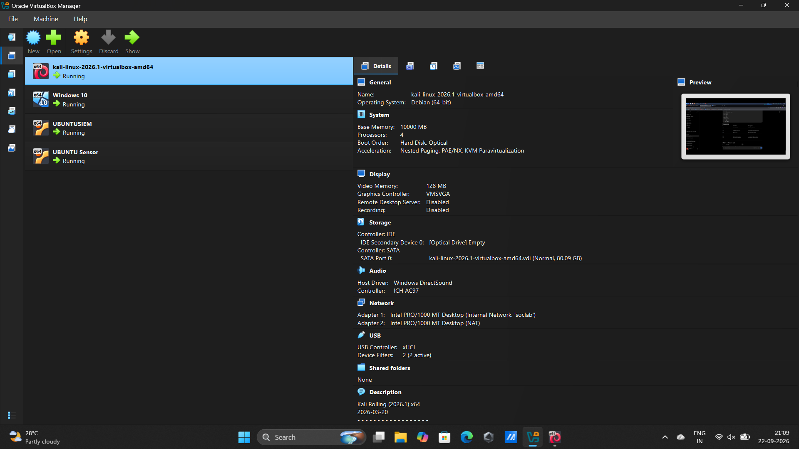
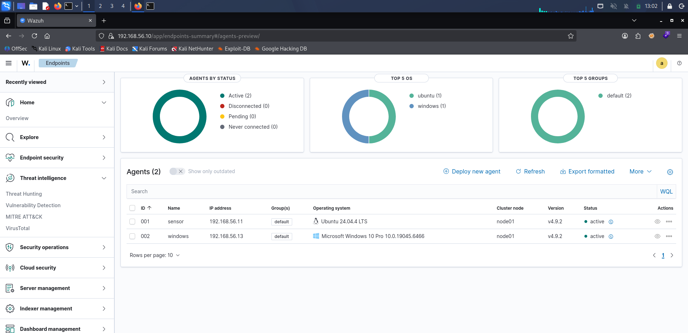
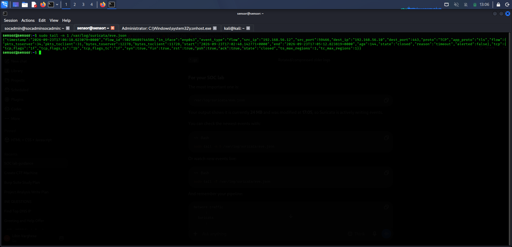
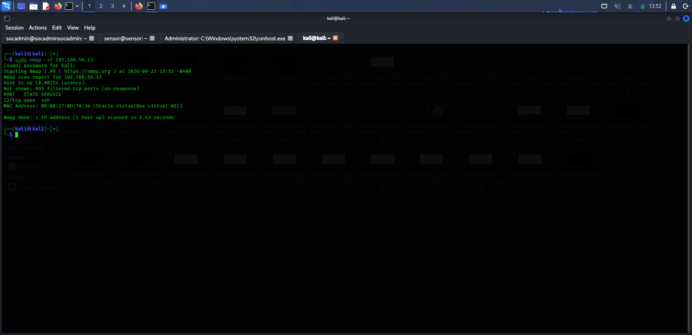
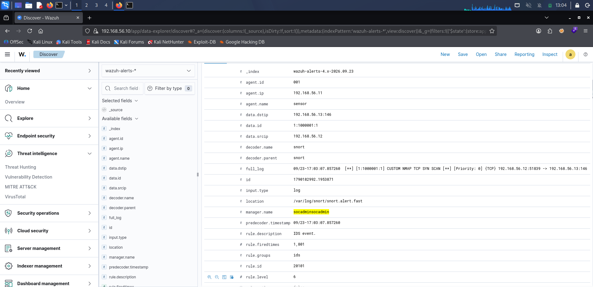

# 🛡️ ADVANCED SOC LAB

### Wazuh • Suricata • Snort • Kali Linux • Windows

<p align="center">


</p>

> **A hands-on 4-VM Security Operations Center laboratory for students and cybersecurity learners to understand SIEM, network intrusion detection, attack simulation, alert forwarding, and security event investigation.**

---

## 📌 Project Overview

A Security Operations Center (SOC) brings together security monitoring, detection, investigation, and response capabilities.

This project demonstrates how a small SOC environment can be built using open-source security technologies inside **VirtualBox**.

The lab consists of four virtual machines:

- 🛡️ **Wazuh SIEM** — centralized security monitoring and alert management
- 🔍 **Ubuntu Sensor** — network monitoring using Suricata and Snort
- 🖥️ **Windows 10** — monitored endpoint
- ⚔️ **Kali Linux** — attacker and security testing machine

The main detection scenario in this lab is an **Nmap TCP SYN scan** launched from Kali Linux against the Windows endpoint.

The traffic is detected by a **custom Snort rule**, forwarded through the **Wazuh Agent**, and processed by a **custom Wazuh rule** that generates a **Level 7 security alert**.

---

## 🎯 Learning Objectives

By completing this lab, you will learn how to:

- Build a small SOC environment using virtual machines
- Configure an isolated VirtualBox network
- Deploy Wazuh as a SIEM
- Configure Suricata for network monitoring
- Configure Snort as a network intrusion detection system
- Deploy and configure Wazuh Agents
- Monitor a Windows endpoint
- Perform controlled network reconnaissance using Nmap
- Create a custom Snort detection rule
- Forward IDS events to Wazuh
- Create a custom Wazuh detection rule
- Understand how security events move from a sensor to a SIEM
- Investigate a network reconnaissance event from a SOC analyst perspective

---

# 🏗️ Lab Architecture

The lab uses four virtual machines connected through an isolated VirtualBox Internal Network.

```text
                         ⚔️ ATTACKER
                         Kali Linux
                       192.168.56.12
                              │
                              │
                         Nmap SYN Scan
                              │
                              ▼
                       🖥️ WINDOWS
                       Windows 10
                     192.168.56.13
                              │
                              │ Network Traffic
                              ▼
                     🔍 UBUNTU SENSOR
                      192.168.56.11
                              │
                 ┌────────────┴────────────┐
                 │                         │
                 ▼                         ▼
            🔎 SURICATA                🚨 SNORT
          Network Telemetry       Custom Detection Rule
                 │                    SID 1000001
                 │                         │
                 └────────────┬────────────┘
                              │
                         Wazuh Agent
                              │
                              ▼
                      🛡️ WAZUH SIEM
                      192.168.56.10
                              │
                              │ Custom Rule 100100
                              ▼
                         🚨 LEVEL 7
                  Custom Nmap TCP SYN
                       Scan Detected
```

---

## 🖥️ Virtual Machine Configuration

| VM | Role | Operating System | IP Address |
|---|---|---|---|
| VM1 | 🛡️ SIEM | Ubuntu Server 24.04 | `192.168.56.10` |
| VM2 | 🔍 Sensor | Ubuntu Server 24.04 | `192.168.56.11` |
| VM3 | 🖥️ Victim | Windows 10 | `192.168.56.13` |
| VM4 | ⚔️ Attacker | Kali Linux | `192.168.56.12` |

### Component Distribution

| Component | VM |
|---|---|
| Wazuh Manager | SIEM |
| Wazuh Indexer | SIEM |
| Wazuh Dashboard | SIEM |
| Wazuh Agent | Sensor |
| Wazuh Agent | Windows |
| Suricata | Sensor |
| Snort | Sensor |
| Nmap | Kali |
| Windows OpenSSH | Windows |

---

# 🌐 Network Configuration

Each virtual machine uses two network adapters.

| Adapter | Type | Purpose |
|---|---|---|
| Adapter 1 | Internal Network | Isolated SOC lab traffic |
| Adapter 2 | NAT | Internet access for updates and package installation |

The Internal Network used by the lab is:

```text
soclab
```

All four VMs must use the same Internal Network name.

### IP Address Plan

```text
192.168.56.10  →  Wazuh SIEM
192.168.56.11  →  Sensor
192.168.56.12  →  Kali Attacker
192.168.56.13  →  Windows Victim
```

> ⚠️ These IP addresses belong to the isolated lab network. Do not expose the lab directly to an untrusted network.

---

# 🔄 Detection Pipeline

The most important concept in this project is understanding how an attack becomes a SIEM alert.

```text
┌───────────────┐
│ Kali Linux    │
│ 192.168.56.12 │
└───────┬───────┘
        │
        │ Nmap SYN Scan
        ▼
┌───────────────┐
│ Windows 10    │
│ 192.168.56.13 │
└───────┬───────┘
        │
        │ Network Traffic
        ▼
┌────────────────────────┐
│ Ubuntu Sensor          │
│ 192.168.56.11          │
│                        │
│ Suricata + Snort       │
└───────────┬────────────┘
            │
            │ Snort Event
            ▼
┌────────────────────────┐
│ Wazuh Agent            │
└───────────┬────────────┘
            │
            ▼
┌────────────────────────┐
│ Wazuh Manager          │
│ 192.168.56.10          │
└───────────┬────────────┘
            │
            │ Rule 100100
            ▼
┌────────────────────────┐
│ Level 7 Alert          │
│                        │
│ Custom Nmap TCP SYN    │
│ Scan Detected          │
└────────────────────────┘
```

### In simple terms

> **Attack → Detect → Collect → Analyze → Investigate**

This is one of the most important SOC concepts demonstrated by this project.

---

# 🧰 Technologies Used

| Technology | Purpose |
|---|---|
| 🛡️ Wazuh | SIEM and security event management |
| 🔎 Suricata | Network threat detection and telemetry |
| 🚨 Snort | Network intrusion detection |
| ⚔️ Kali Linux | Security testing and attack simulation |
| 🖥️ Windows 10 | Monitored endpoint |
| 📦 VirtualBox | Virtualization platform |
| 🔍 Nmap | Network reconnaissance |
| 🐧 Ubuntu Server 24.04 | SIEM and Sensor operating system |

### Additional tools used during the lab

| Tool | Purpose |
|---|---|
| `systemctl` | Manage and inspect system services |
| `journalctl` | Read system logs |
| `tail` | Follow and inspect log files |
| `grep` | Search inside logs |
| `ssh` | Remote access to lab VMs |
| `ip` / `ifconfig` | Inspect network interfaces and IP addresses |
| `dpkg` / `apt` | Manage packages on Ubuntu |
| `sudo` | Run administrative commands |
| `wazuh-analysisd` | Validate the Wazuh analysis/rule configuration |
| `wazuh-logtest` | Test Wazuh decoders and rules offline |

---

## 🧰 Languages, Syntax & Technologies

This is primarily a **cybersecurity lab and documentation project** rather than a traditional software application. It is not built with a single programming language — instead, it brings together scripting skills, detection-rule syntax, configuration formats, and security platforms.

<p align="center">
  
  
  
  
  
  
</p>

### 💻 Languages & Syntax

| Category | Language / Syntax | Used in this lab |
|---|---|---|
| 💻 Scripting | **Bash / Shell** | Linux administration, service management, log inspection, and Wazuh, Suricata, Snort and Nmap commands |
| 🚦 Detection Rules | **Snort Rule Syntax** | Custom network detection rule for the Nmap TCP SYN scan |
| 📝 Configuration | **XML** | Custom Wazuh detection rule configuration |
| 🧾 Data Formats | **JSON** | Suricata EVE JSON network telemetry and Wazuh alert data |
| 🖥️ Scripting | **PowerShell / Windows command-line** | Windows administration and testing where applicable |
| 📚 Documentation | **Markdown** | Project documentation |

### 🛡️ Security Tools & Platforms

| Tool / Platform | Version | Role in the lab |
|---|---|---|
| 🛡️ **Wazuh** | `4.9.2` | Centralized SIEM monitoring and alert management |
| 🔎 **Suricata** | `7.0.3` | Network monitoring and EVE JSON telemetry |
| 🚨 **Snort** | `2.9.20` | Network intrusion detection with custom rules |
| 🔍 **Nmap** | — | Network reconnaissance / TCP SYN scan |
| ⚔️ **Kali Linux** | — | Attack simulation and security testing |
| 🐧 **Ubuntu Server** | `24.04` | Operating system for the SIEM and Sensor VMs |
| 🖥️ **Windows 10** | — | Monitored endpoint (Victim) |
| 📦 **VirtualBox** | — | Virtualization platform for the lab |

---

# 📋 Prerequisites

Before starting the lab, make sure your host system has:

- VirtualBox installed
- Hardware virtualization enabled
- At least **16 GB RAM recommended**
- Sufficient free disk space for four virtual machines
- Ubuntu Server ISO
- Windows 10 ISO
- Kali Linux VirtualBox image

### Recommended VM resources

| VM | RAM | vCPU |
|---|---:|---:|
| Wazuh SIEM | 4 GB+ | 2 |
| Sensor | 2–4 GB | 2 |
| Windows 10 | 2–4 GB | 2 |
| Kali Linux | 2–4 GB | 2 |

> 💡 Resource requirements may vary depending on the host system and the number of services running simultaneously.

---

# 🚀 LAB SETUP

## 1️⃣ Create the VirtualBox Network

Open:

**VirtualBox → Tools / Network → Internal Network**

Use:

```text
soclab
```

Configure **Adapter 1** on every VM as:

```text
Attached to: Internal Network
Name: soclab
```

Configure **Adapter 2** as:

```text
Attached to: NAT
```

The Internal Network is used for SOC traffic, while NAT provides internet connectivity for updates and package installation.

---

# 2️⃣ Create the Four Virtual Machines

Create the following machines:

### VM1 — SIEM

```text
OS: Ubuntu Server 24.04
IP: 192.168.56.10
Role: Wazuh Manager / Indexer / Dashboard
```

### VM2 — Sensor

```text
OS: Ubuntu Server 24.04
IP: 192.168.56.11
Role: Suricata / Snort / Wazuh Agent
```

### VM3 — Victim

```text
OS: Windows 10
IP: 192.168.56.13
Role: Monitored endpoint
```

### VM4 — Attacker

```text
OS: Kali Linux
IP: 192.168.56.12
Role: Attack simulation
```

---

# 3️⃣ Configure Static IP Addresses

## Linux VMs

Check the available interfaces:

```bash
ip a
```

Identify the interface connected to the Internal Network.

For this lab, the internal interface used by the Ubuntu Sensor is:

```text
enp0s3
```

Configure the appropriate static address using Netplan.

Example:

```yaml
network:
  version: 2
  ethernets:
    enp0s3:
      addresses:
        - 192.168.56.11/24
```

Apply the configuration:

```bash
sudo netplan apply
```

> ⚠️ Interface names can differ between systems. Always verify with `ip a` before editing Netplan.

### Windows

Configure the Windows Internal Network adapter with:

```text
IP Address:      192.168.56.13
Subnet Mask:     255.255.255.0
```

### Verify connectivity

From Kali:

```bash
ping 192.168.56.13
```

From the Sensor:

```bash
ping 192.168.56.10
```

The machines should be able to communicate through the isolated SOC network.

---

# 4️⃣ Install and Configure Wazuh

The SIEM machine runs:

- Wazuh Manager
- Wazuh Indexer
- Wazuh Dashboard
- Filebeat

The completed lab uses:

```text
Wazuh Version: 4.9.2
SIEM IP: 192.168.56.10
```

After installation, access the dashboard through the Wazuh Dashboard address configured on the SIEM.

> 🔐 Never publish your Wazuh administrator password or other credentials in this repository.

---

# 5️⃣ Configure the Ubuntu Sensor

The Sensor machine runs three important security components:

```text
Suricata
Snort
Wazuh Agent
```

Its role is to observe network traffic, generate security events, and forward those events to the Wazuh Manager.

---

# 🔎 5.1 Suricata

Suricata is used for network security monitoring and generates structured JSON events.

The main EVE JSON log is:

```text
/var/log/suricata/eve.json
```

Check the log:

```bash
sudo tail -n 5 /var/log/suricata/eve.json
```

Follow new events:

```bash
sudo tail -f /var/log/suricata/eve.json
```

The completed lab uses:

```text
Suricata 7.0.3
Interface: enp0s3
```

### Verified during the lab

- Suricata **7.0.3** was installed and the service was active during testing.
- The installation loaded approximately **52,658 rules**.
- Suricata monitored the internal interface using **AF_PACKET** on `enp0s3`.
- The EVE JSON statistics showed active packet processing with **`kernel_drops: 0`**, indicating no packets were dropped by the kernel during monitoring.

> These observations confirm that Suricata was operating and generating structured network telemetry. They do not, by themselves, prove that a security intrusion was detected.

### Important distinction

Suricata can generate different types of events.

For example:

```json
"event_type": "flow"
```

represents network-flow telemetry.

A flow event should not automatically be described as a security alert. This distinction is useful when learning how IDS telemetry works.

---

# 🚨 5.2 Snort

Snort is used as an additional network intrusion detection system.

The Sensor uses:

```text
Snort 2.9.20
```

### Configuration used by the lab

```text
Configuration file:  /etc/snort/snort.conf
Internal network:    192.168.56.0/24
Interface:           enp0s3
Alert log:           /var/log/snort/snort.alert.fast
```

Validate the configuration:

```bash
sudo snort -T -c /etc/snort/snort.conf
```

The readable fast alert log is:

```text
/var/log/snort/snort.alert.fast
```

Check recent alerts:

```bash
sudo tail -n 20 /var/log/snort/snort.alert.fast
```

---

# 🧩 5.3 Custom Snort Detection Rule

To specifically detect the TCP SYN activity generated by the Kali machine, a custom Snort rule was created.

```snort
alert tcp 192.168.56.12 any -> 192.168.56.13 any (
    flags:S;
    msg:"CUSTOM NMAP TCP SYN SCAN";
    detection_filter:track by_src,count 10,seconds 5;
    sid:1000001;
    rev:1;
)
```

### Rule Breakdown

| Parameter | Meaning |
|---|---|
| `tcp` | Monitor TCP traffic |
| `192.168.56.12` | Kali attacker |
| `192.168.56.13` | Windows target |
| `flags:S` | Match TCP SYN packets |
| `count 10` | Require 10 matching packets |
| `seconds 5` | Within a 5-second window |
| `sid:1000001` | Custom Snort signature |
| `rev:1` | Rule revision |

The custom Snort event is identified as:

```text
1:1000001:1
```

---

# 📡 6️⃣ Configure the Wazuh Agent on the Sensor

The Wazuh Agent on the Sensor collects security events from the IDS tools and forwards them to the Wazuh Manager.

The relevant logs include:

```text
/var/log/suricata/eve.json
/var/log/snort/snort.alert.fast
```

The Sensor's Wazuh Agent is configured to monitor these logs.

Check the agent:

```bash
sudo systemctl status wazuh-agent
```

Test connectivity to the Wazuh Manager:

```bash
nc -zv 192.168.56.10 1514
```

A successful connection indicates that the Sensor can communicate with the Wazuh Manager.

---

# 🖥️ 7️⃣ Configure the Windows Endpoint

The Windows machine acts as the monitored endpoint.

```text
IP: 192.168.56.13
OS: Windows 10
```

Install the Wazuh Agent and configure it to communicate with:

```text
192.168.56.10
```

The Windows Agent monitors Windows security events and forwards relevant events to the Wazuh Manager.

---

# 🧪 DETECTION LAB

# ⚔️ 8️⃣ Perform an Nmap SYN Scan

From the Kali attacker machine:

```bash
sudo nmap -sS 192.168.56.13
```

The `-sS` option performs a TCP SYN scan.

The purpose of this test is to generate controlled reconnaissance traffic against the Windows endpoint inside the isolated lab.

### Example result

The completed test identified the Windows host as reachable and discovered an SSH service on:

```text
22/tcp
```

---

# 🔍 9️⃣ Observe the Sensor

While the scan is running, observe the Sensor.

### Suricata

```bash
sudo tail -f /var/log/suricata/eve.json
```

### Snort

```bash
sudo tail -f /var/log/snort/snort.alert.fast
```

The Snort custom rule should begin generating events when the configured detection threshold is reached.

---

# 🚨 🔟 Snort Detects the Scan

The custom Snort signature:

```text
1:1000001:1
```

generates an event containing:

```text
CUSTOM NMAP TCP SYN SCAN
```

The event identifies the traffic between:

```text
Source:      192.168.56.12
Destination: 192.168.56.13
```

The Wazuh Agent then collects this event from the Snort log.

---

# 📡 1️⃣1️⃣ Snort Event Reaches Wazuh

The event is forwarded through the following path:

```text
Snort
   ↓
/var/log/snort/snort.alert.fast
   ↓
Wazuh Agent
   ↓
Wazuh Manager
   ↓
Wazuh Analysis Engine
   ↓
Wazuh Dashboard
```

This demonstrates an important SOC concept:

> An IDS detects the activity, while the SIEM provides centralized collection, analysis, and investigation.

---

# 🧠 1️⃣2️⃣ Custom Wazuh Detection Rule

After confirming that the Snort event was reaching Wazuh, a custom Wazuh rule was created to identify the specific Snort signature.

```xml
<rule id="100100" level="7">
    <if_sid>20100</if_sid>
    <id>^1:1000001:1$</id>
    <decoded_as>snort</decoded_as>
    <description>Custom Nmap TCP SYN Scan Detected</description>
    <group>network_scan,nmap,</group>
</rule>
```

### Rule Logic

```text
Snort SID
1:1000001:1
      │
      ▼
Wazuh receives Snort event
      │
      ▼
Rule 100100 matches
      │
      ▼
Level 7
      │
      ▼
Custom Nmap TCP SYN Scan Detected
```

### Rule Components

| Field | Value |
|---|---|
| Wazuh Rule ID | `100100` |
| Alert Level | `7` |
| Decoder | `snort` |
| Snort Signature | `1:1000001:1` |
| Description | `Custom Nmap TCP SYN Scan Detected` |
| Groups | `network_scan`, `nmap` |

---

# 🎯 1️⃣3️⃣ Detection Result

The completed test demonstrated the following end-to-end pipeline:

```text
Kali Linux
192.168.56.12
      │
      │ Nmap SYN Scan
      ▼
Windows 10
192.168.56.13
      │
      │ Network Traffic
      ▼
Snort
      │
      │ 1:1000001:1
      ▼
Wazuh Agent
      │
      ▼
Wazuh Manager
192.168.56.10
      │
      │ Rule 100100
      ▼
Level 7 Alert
      │
      ▼
Custom Nmap TCP SYN Scan Detected
```

This confirms that the lab is not simply generating network traffic; the activity can travel through the complete detection and monitoring pipeline.

---

# 🔎 Investigation

When investigating a security event, a SOC analyst should ask:

### 1. What happened?

A TCP SYN scanning activity was generated against the Windows endpoint.

### 2. Where did it originate?

```text
192.168.56.12
```

The source was the Kali Linux attacker machine.

### 3. What was targeted?

```text
192.168.56.13
```

The target was the Windows endpoint.

### 4. Which security tool detected it?

The custom Snort signature detected the TCP SYN activity.

### 5. How did Wazuh process it?

The Wazuh Agent collected the Snort event and forwarded it to the Wazuh Manager, where the custom Wazuh rule identified the event.

### 6. What was the final classification?

```text
Rule: 100100
Level: 7
Description: Custom Nmap TCP SYN Scan Detected
```

---

# 📸 Lab Evidence

The following screenshots document important stages of the completed lab.

> **Note:** The screenshots are evidence of specific stages of the lab. They are not intended to represent every configuration step.

### 🖥️ 1. Four-VM Lab Environment

The VirtualBox environment shows the four machines used by the SOC lab.

**Machines:**

```text
Kali Linux
Windows 10
Ubuntu SIEM
Ubuntu Sensor
```

<p align="center">
  
</p>

---

### 🛡️ 2. Wazuh Agents

The Wazuh Dashboard shows the Sensor and Windows endpoint connected as active agents.

<p align="center">
  
</p>

---

### 🔍 3. Suricata Telemetry

The Sensor displays structured Suricata telemetry from:

```text
/var/log/suricata/eve.json
```

<p align="center">
  
</p>

> **Important:** The displayed event is a Suricata `flow` event showing network telemetry from Kali Linux (`192.168.56.12`) toward the SIEM (`192.168.56.10`). It should be understood as network telemetry / EVE JSON evidence rather than automatically being described as a Suricata security alert.

---

### ⚔️ 4. Nmap SYN Scan

The Kali machine performs the controlled reconnaissance test:

```bash
sudo nmap -sS 192.168.56.13
```

<p align="center">
  
</p>

---

### 🚨 5. Snort Event in Wazuh

The Wazuh Dashboard displays the Snort-generated event containing the custom signature:

```text
1:1000001:1
CUSTOM NMAP TCP SYN SCAN
```

<p align="center">
  
</p>

> **Note:** This screenshot shows the Snort event being processed by Wazuh's **generic IDS rule `20101` (Level 6)**. The final custom **Level 7 rule `100100`** was separately verified in the Wazuh alert logs.

---

# 🔧 Useful Commands

Quick reference for the commands used while building and testing this lab.

### Check IP configuration

```bash
ip addr
```

```bash
ifconfig
```

### Manage services

```bash
sudo systemctl status wazuh-agent
sudo systemctl restart wazuh-agent

sudo systemctl status suricata
sudo systemctl status snort
```

### Read system logs

```bash
sudo journalctl -u suricata -n 50 --no-pager
sudo journalctl -u snort -n 50 --no-pager
```

### Monitor and search IDS logs

Follow new Suricata events:

```bash
sudo tail -f /var/log/suricata/eve.json
```

Show the most recent EVE JSON events:

```bash
sudo tail -n 5 /var/log/suricata/eve.json
```

Show recent Snort alerts:

```bash
sudo tail -n 20 /var/log/snort/snort.alert.fast
```

Search Snort alerts for the custom signature:

```bash
sudo grep "CUSTOM NMAP TCP SYN SCAN" /var/log/snort/snort.alert.fast
```

### Remote access

```bash
ssh <username>@192.168.56.10
```

Replace `<username>` with the appropriate Linux username configured on the target VM.

### Package management

```bash
sudo apt update
sudo apt install <package>
dpkg -l | grep suricata
```

### Validate Snort configuration

```bash
sudo snort -T -c /etc/snort/snort.conf
```

### Wazuh analysis and log testing

Validate the Wazuh analysis/rule configuration:

```bash
sudo /var/ossec/bin/wazuh-analysisd -t
```

Test Wazuh decoders and rules offline with a sample event:

```bash
sudo /var/ossec/bin/wazuh-logtest
```

### Attack simulation

Run the Nmap TCP SYN scan from Kali Linux against the Windows endpoint:

```bash
sudo nmap -sS 192.168.56.13
```

---

# 🧩 Troubleshooting

| Problem | Possible Solution |
|---|---|
| VMs cannot communicate | Verify that all VMs use the same Internal Network name |
| No internet inside VM | Check that Adapter 2 is configured as NAT |
| Wazuh Agent disconnected | Restart the Wazuh Agent service |
| No Snort alerts | Verify the Snort interface and custom rule |
| No Suricata events | Verify the Suricata interface and EVE JSON configuration |
| No Wazuh IDS events | Verify that the Wazuh Agent can reach `192.168.56.10:1514` |
| Incorrect network interface | Run `ip a` and verify the Internal Network interface |
| Wazuh rule not loading | Validate the Wazuh rule configuration before restarting the service |

---

# 📚 What I Learned

Building this lab helped demonstrate that a SOC is not simply a dashboard displaying alerts.

The complete workflow is:

```text
Generate
   ↓
Detect
   ↓
Collect
   ↓
Analyze
   ↓
Investigate
```

The project provided practical experience with:

- SIEM architecture
- Network intrusion detection
- Network reconnaissance
- Security event collection
- IDS-to-SIEM integration
- Custom detection rules
- Log analysis
- Source and destination investigation
- Windows endpoint monitoring
- SOC investigation methodology

One of the most important lessons was understanding the difference between the tools:

```text
Suricata / Snort
        ↓
   Detect network activity

Wazuh Agent
        ↓
   Collect and forward events

Wazuh Manager
        ↓
   Analyze and classify events

Wazuh Dashboard
        ↓
   Investigate and visualize events
```

---

# 🚀 Future Improvements

This lab can be expanded with additional SOC capabilities.

Possible improvements include:

- 🔎 Add MITRE ATT&CK mapping
- 🛡️ Add additional Wazuh detection rules
- 🪟 Add Sysmon for richer Windows telemetry
- 🕵️ Add TheHive for incident management
- 🌐 Add a vulnerable web application for web attack detection
- 🚨 Create additional Snort and Suricata rules
- ⚡ Experiment with automated response
- 🖥️ Add additional monitored endpoints
- ☁️ Explore cloud-based SOC architectures
- 🤖 Automate parts of the lab deployment

---

# 📝 Medium Article

A detailed write-up of this project is also available on Medium.

### 📖 Read the project article

**I Built a 4-VM SOC Lab to Detect an Nmap SYN Scan with Wazuh, Suricata and Snort**

👉 https://medium.com/@libinvarghese412/i-built-a-4-vm-soc-lab-to-detect-an-nmap-syn-scan-with-wazuh-suricata-and-snort-12d8ebd1b35d?postPublishedType=initial

---

# ⚠️ Disclaimer

This project is intended **strictly for educational purposes and authorized security testing**.

The attack simulations demonstrated in this repository should only be performed against:

- Systems you own
- Isolated laboratory environments
- Systems for which you have explicit authorization to test

Never use these techniques against systems or networks without permission.

---

# 📜 License

This project is released under the **MIT License**.

See the [`LICENSE`](LICENSE) file for details.

---

<p align="center">

### 🛡️ Build • Attack • Detect • Investigate

**Advanced SOC Lab**

</p>